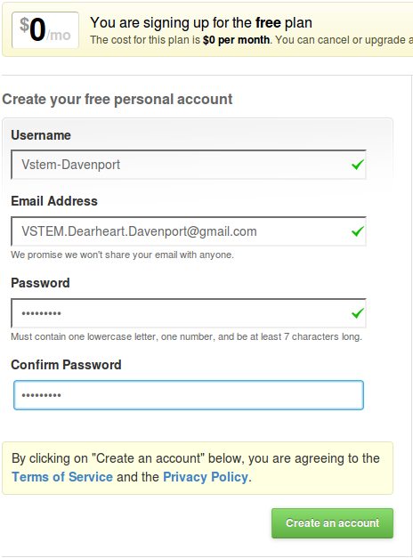
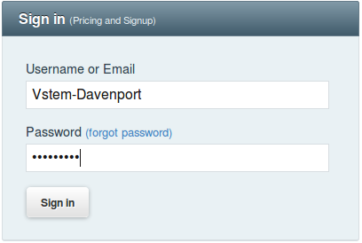

.. _setup_github:

#############################
 Create GitHub Account
#############################

Use this guide to setup free public repository storage and hosting on GitHub. 

Register a GitHub Account
=============================

+ Click this link to `the GitHub signup page <https://github.com/signup/free>`_. 
+ Enter your information (four fields).
+ Click on :guilabel:`Create an account`.

Login to GitHub
=============================

+ Click this link to login to GitHub: https://github.com/session
+ Enter your **Username** and **Password**
+ Click the :guilabel:`Sign in` button

